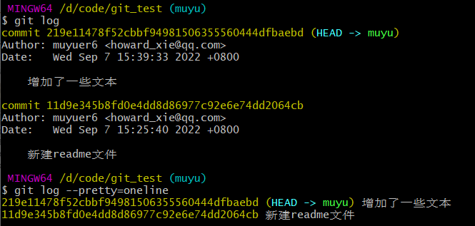

# git的基本使用

## 创建版本库

在指定文件夹打开gitbash，输入`git init`将该目录变成git管理的仓库。

## 文件添加到版本库

注意，所有的版本控制系统都只能跟踪文本文件的改动，比如txt，程序代码，而对图片、视频等文件，虽然能由版本控制系统管理，但没法跟踪文件的变化，只能把二进制文件每次改动串起来，也就是只知道图片从100KB改成了120KB，但到底改了啥，版本控制系统不知道，也没法知道。

第一步，用命令`git add`告诉Git，把文件添加到仓库：

```
git add filename
```

第二步，用命令`git commit`告诉Git，把文件提交到仓库：

```
$ git commit -m "本次提交说明：（xxx）"(不需要双引号)
```

## 撤销操作

最终你只会有一个提交——第二次提交将代替第一次提交的结果。

```
$ git commit -m 'initial commit'
$ git add forgotten_file
$ git commit --amend
```


设置默认编辑器

```
git config --global core.editor "'D:/Apps/Notepad3/Notepad3.exe' -multiInst -notabbar -nosession -noPlugin" 
```


## 版本查看

`git status`命令可以让我们时刻掌握仓库当前的状态

`git diff`顾名思义就是查看difference，显示的格式正是Unix通用的diff格式。

`git log`命令显示从最近到最远的提交日志

如果嫌输出信息太多，看得眼花缭乱的，可以试试加上`--pretty=oneline`参数




## 版本回滚

git reset`

首先，Git必须知道当前版本是哪个版本，在Git中，用`HEAD`表示当前版本，也就是最新的提交`1094adb...`（注意我的提交ID和你的肯定不一样），上一个版本就是`HEAD^`，上上一个版本就是`HEAD^^`，当然往上100个版本写100个`^`比较容易数不过来，所以写成`HEAD~100`。

现在，我们要把当前版本`append GPL`回退到上一个版本`add distributed`，就可以使用`git reset`命令：

```bash
$ git reset --hard HEAD^
HEAD is now at e475afc add distributed


#回到指定版本
$ git reset --hard 1094a
```


找不到新版本的`commit id`怎么办？

命令`git reflog`用来记录你的每一次命令：


## 移除文件

`git rm filename`

下一次提交时，该文件就不再纳入版本管理了。 如果要删除之前修改过或已经放到暂存区的文件，则必须使用 强制删除选项 -f（译注：即 force 的首字母）。 这是一种安全特性，用于防止误删尚未添加到快照的数据，这 样的数据不能被 Git 恢复。


另外一种情况是，我们想把文件从 Git 仓库中删除（亦即从暂存区域移除），但仍然希望保留在当前工作目录 中。 换句话说，你想让文件保留在磁盘，但是并不想让 Git 继续跟踪。 当你忘记添加 .gitignore 文件，不小 心把一个很大的日志文件或一堆 .a 这样的编译生成文件添加到暂存区时，这一做法尤其有用。 为达到这一目 的，使用 --cached 选项：

`git rm --cached filename`

## 其他操作

注意，进行git操作时，如`git log`，然后非正常退出(如使用CTRL+C退出)，此时git输入不会显示。

解决方法：

1. 键入`reset`命令重置git bash
2. 关闭git bash重新打开


# 指令集

## git add

```
$ git add -h
usage: git add [<options>] [--] <pathspec>...
  -n, --dry-run dry run
  -v, --verbose be verbose
  -i, --interactive interactive picking
  -p, --patch select hunks interactively
  -e, --edit edit current diff and apply
  -f, --force allow adding otherwise ignored files
  -u, --update update tracked files
  --renormalize renormalize EOL of tracked files (implies -u)
  -N, --intent-to-add record only the fact that the path will be added
later
  -A, --all add changes from all tracked and untracked files
  --ignore-removal ignore paths removed in the working tree (same
as --no-all)
  --refresh don't add, only refresh the index
  --ignore-errors just skip files which cannot be added because of
errors
  --ignore-missing check if - even missing - files are ignored in
dry run
  --chmod (+|-)x override the executable bit of the listed files
```


# 操作

### 分支操作

1. 增加了分支dev
2. 合并了分支dev。的确按教程所说，切换分支而未合并前，分支的修改在主线看不到。合并后一致。
3. 删除了分支dev。
