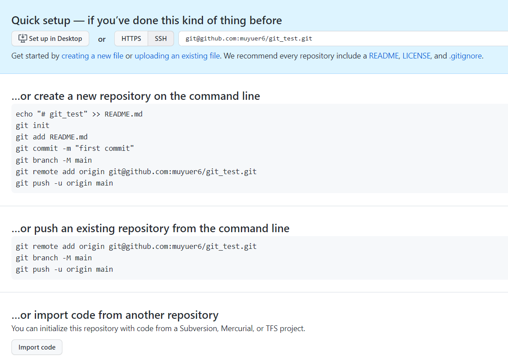

# 添加远程库

先新建一个仓库，假设命名为git_test

通过命令

```
git remote add origin git@github.com:myname/git_test.git
```

将仓库与本地内容关联

下一步，就可以把本地库的所有内容推送到远程库上：

```
git push -u origin main
```

前提是，仓库为空，没有如readme.md之类的文件

[(1条消息) git 使用报错: fatal: Couldn't find remote ref master的解决方法_勋彰的博客-CSDN博客](https://blog.csdn.net/ltstud/article/details/79935001)

以上无效

删除仓库再新建，按照官方给的步骤



实际采用的是

```
git branch -M main
git remote add origin git@github.com:muyuer6/git_test.git
git push -u origin main
```

然后成功


# 删除远程库

如果添加的时候地址写错了，或者就是想删除远程库，可以用`git remote rm <name>`命令。使用前，建议先用`git remote -v`查看远程库信息

然后，根据名字删除，比如删除`origin`：

```
$ git remote rm origin
```

# 小结

要关联一个远程库，使用命令`git remote add origin git@server-name:path/repo-name.git`；

关联一个远程库时必须给远程库指定一个名字，`origin`是默认习惯命名；

关联后，使用命令`git branch -M main`指定分支，使用``git push -u origin main`第一次推送main分支的所有内容；

此后，每次本地提交后，只要有必要，就可以使用命令`git push origin main`推送最新修改；